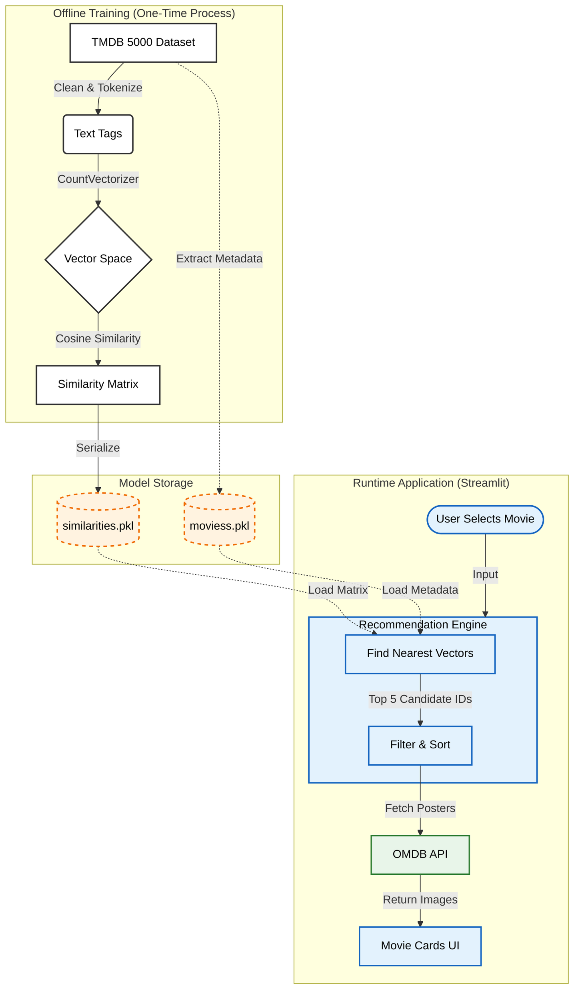

# 🎬 NextWatch


Content-based movie recommendation system that suggests films based on **plot, genre, and cast similarity**. Built with Python, Streamlit, and the OMDB API for real-time metadata.

---

## 🔄 How It Works



### 🧠 Understanding the Process
Think of this as a **"Matchmaker" for movies**:
1.  **The "DNA"**: We mash up keywords, genres, and cast into a "soup" of text.
2.  **The Math**: We turn that soup into a mathematical **Vector** (a list of numbers).
3.  **The Match**: When you pick a movie, we find other vectors pointing in the **same direction** (Cosine Similarity).
---

## � Quick Start

```bash
git clone https://github.com/Deekshith06/NextWatch.git
cd NextWatch
python -m venv .venv
source .venv/bin/activate  # Windows: .venv\Scripts\activate
pip install -r requirements.txt
streamlit run app.py
```

> **Note**: Add your OMDB API key to `.streamlit/secrets.toml` to fetch movie posters.

---

## 📂 Project Structure

```
├── app.py                  # Main Application logic
├── requirements.txt        # Dependencies
├── .streamlit/             # API Configuration
│   └── secrets.toml
└── data/                   # ML Models & Data
    ├── moviess.pkl
    └── similarities.pkl
```

---

## 🔧 Tech Stack

| Component | Technology |
|-----------|------------|
| Frontend | Streamlit (Custom CSS) |
| ML Model | Scikit-learn (Cosine Similarity) |
| Data Processing | Pandas, NumPy |
| API | OMDB (Real-time Metadata) |

---

## 📊 Features

| Feature | Description |
|--------|-------|
| **Smart Search** | Instantly find any movie in the 5000+ database. |
| **Hybrid Ranking** | Combines content similarity with weighted ratings for quality suggestions. |
| **Live Metadata** | Fetches posters, plots, and cast details on the fly. |
| **Responsive UI** | Mobile-friendly grid layout with dark mode aesthetics. |

---

## 👤 Author

**Seelaboyina Deekshith**

[](https://github.com/Deekshith06)
[](https://www.linkedin.com/in/deekshith030206)
[](mailto:seelaboyinadeekshith@gmail.com)

---

> ⭐ Star this repo if it helped you!
